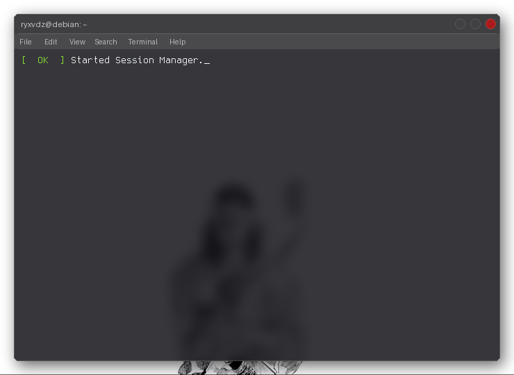

<div align="center">

# 🖥️ Terminal GIF for GitHub Profile

**An animated terminal GIF showcasing your GitHub stats — auto-generated daily.**



[](https://github.com/dbuzatto/gif-terminal/stargazers)
[](https://github.com/dbuzatto/gif-terminal/network/members)
[](LICENSE)

</div>

---

## ✨ Features

- 📊 Fetches **real-time GitHub stats** (commits, stars, PRs, followers, rank, and more)
- 🎨 **Two themes** — classic dark terminal or macOS Liquid Glass
- ⚙️ **Auto-regenerated daily** via GitHub Actions
- 🚀 Easy to set up — fork, configure, and you're done

---

## 🎨 Themes

### Default — Classic dark terminal
The original theme: a clean dark terminal with ANSI colors.

```bash
python generate_with_stats.py
```

### Liquid Glass — macOS-style frosted glass
A translucent macOS-style window floating over your custom wallpaper, with vivid text colors and traffic light buttons.

```bash
python generate_liquid_glass.py
```

> Place your wallpaper at `assets/wallpaper.jpg` before running.

---

## 🚀 Quick Start

### 1. Fork this repository

Click the **Fork** button at the top right of this page.

### 2. Add your GitHub Token

Go to **Settings → Secrets and variables → Actions** and create a new secret:

| Name | Value |
|------|-------|
| `GH_TOKEN` | Your GitHub Personal Access Token (`read:user` scope) |

> 💡 Generate a token at [github.com/settings/tokens](https://github.com/settings/tokens) — only `read:user` permission is needed.

### 3. Set your username

Edit your chosen theme script and update:

```python
USERNAME = "your-username-here"
```

### 4. (Liquid Glass only) Add your wallpaper

Place a `.jpg` image at:

```
assets/wallpaper.jpg
```

### 5. Add to your profile README

```markdown

```

The GIF will be automatically regenerated every day at **6:00 AM UTC**.

---

## 💻 Running Locally

### Install dependencies

```bash
pip install github-readme-terminal requests python-dotenv Pillow

# Install ffmpeg (macOS)
brew install ffmpeg

# Install ffmpeg (Ubuntu/Debian)
sudo apt install ffmpeg
```

### Configure your GitHub Token

Create a `.env` file in the project root:

```bash
cp .env.example .env
```

Then edit `.env` and add:

```env
GITHUB_TOKEN=your_github_token_here
```

### Generate the GIF

```bash
# Default theme
python generate_with_stats.py

# Liquid Glass theme
python generate_liquid_glass.py
```

The output will be saved as `output.gif`.

---

## 🗂️ Project Structure

```
.
├── generate_with_stats.py        # Default dark theme
├── generate_liquid_glass.py      # Liquid Glass macOS theme
├── assets/
│   └── wallpaper.jpg             # Wallpaper for Liquid Glass theme
├── output.gif                    # Generated GIF (auto-updated)
├── .env.example                  # Environment variable template
├── .github/
│   └── workflows/
│       ├── generate-gif.yml               # CI — default theme
│       └── generate-gif-liquid-glass.yml  # CI — Liquid Glass theme
└── README.md
```

---

## 🎨 Customization

### Default theme (`generate_with_stats.py`)
- **Skills section** — update the `skills` list with your own tech stack
- **Colors** — use ANSI escape codes to change text colors
- **Commands** — add or remove terminal commands and sections
- **Layout** — adjust width, height, padding, and typing speed

### Liquid Glass theme (`generate_liquid_glass.py`)
- **Wallpaper** — replace `assets/wallpaper.jpg` with any image
- **Glass opacity** — tune `GaussianBlur` radius and overlay alpha in `prepare_glass_layers()`
- **Text colors** — edit the `ConvertAnsiEscape.ANSI_ESCAPE_MAP_TXT_COLOR` override at the top
- **Window layout** — adjust `GIF_W`, `GIF_H`, `WIN_X`, `WIN_Y`, `TITLE_H` constants

---

## 🤝 Contributing

Contributions, issues, and feature requests are welcome!
Feel free to open an [issue](../../issues) or submit a pull request.

---

<div align="center">

If this project helped you, consider leaving a ⭐ — it means a lot!

</div>
